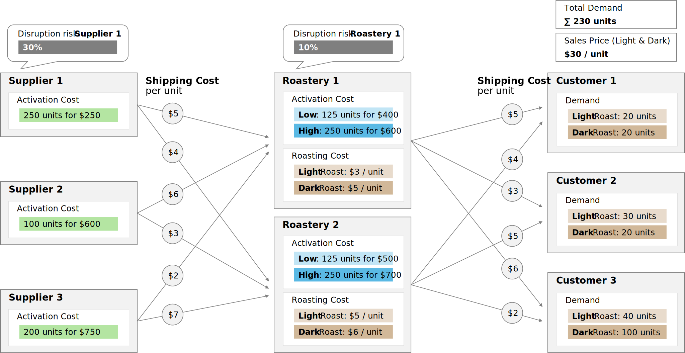
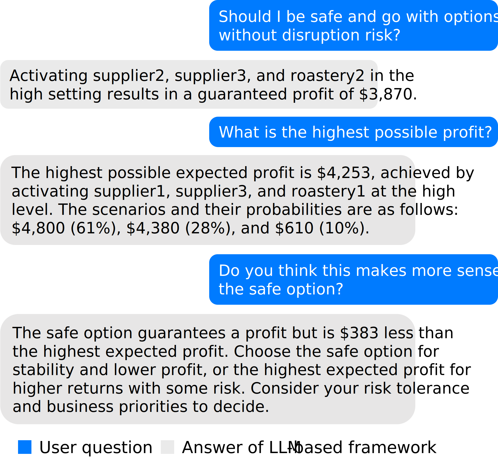

# Higher Profit, Lower Risk? How Large Language Models Shape Decision Behavior in Supply Chain Optimization

## 💡 Abstract
> **_Problem definition:_** Leading supply chain software vendors are integrating Large Language Model (LLM)-based capabilities into their platforms. Although these features move platforms beyond static interfaces with predefined workflows, whether enabling dynamic, conversational interactions improves supply chain decisions remains unclear. This research investigates if access to LLM-aided optimization affects individual decision-making in a stochastic supply chain network design problem.
>
> **_Methodology/results:_** We designed an interactive LLM-based framework with external optimization capabilities to conduct a behavioral lab experiment. In Part 1 of the experiment, participants select suppliers and production sites under disruption risk. The treatment group has access to the LLM-optimization decision support, while the control group completes the task without this aid. In Part 2, we provide all non-dominated solutions, i.e., decisions that maximize expected profit for a given risk level, and elicit individuals' context-specific risk-reward preferences to assess alignment with their prior decisions. Despite providing all participants with the normative optimal solution in Part 1, chat access increases the likelihood of selecting higher performing solutions. Moreover, comparisons between Part 1 and 2 solutions uncover systematic deviations between groups: participants without chat access tend to undershoot their preferences, settling for suboptimal decisions that sacrifice profit at a given risk. Interestingly, participants with chat access frequently overshoot, taking on more risk than intended in favor of higher expected returns. Overall, chat access attenuates the influence of participants' risk preferences on Part 1 solutions.
>
> **_Managerial implications:_** LLMs can democratize optimization by improving the interpretability of complex supply chain solutions for non-experts. However, solving problems through interactive chat can lead managers to focus on profit-driven queries, leading to outcomes that increase risk beyond organizational preferences. Thus, organizations must make deliberate, behaviorally-driven design choices when deploying LLM-driven optimization, to ensure decision outcomes align with their risk preferences.

---

We use this stochastic supply chain network design problem for our behavioral experiment (deterministic basis adapted from [Li et al. 2023](https://arxiv.org/abs/2307.03875)):

  


For our experiment, we extend [Li et al. 2023's](https://arxiv.org/abs/2307.03875) implementation of their LLM-enabled optimization framework [OptiGuide](https://github.com/microsoft/OptiGuide).

For illustration, here is a real user interaction example from our behavioral experiment:




## 📄 Citation
If you use this code, please cite this paper:
```latex
@article{greil2025higher,
  title={Higher Profit, Lower Risk? How Large Language Models Shape Decision Behavior in Supply Chain Optimization},
  author={Greil, Thorsten and Janjevic, Milena and Schiffels, Sebastian and Kirshner, Samuel},
  journal={Available at SSRN 5393044},
  year={2025},
  url={http://dx.doi.org/10.2139/ssrn.5393044}
}
```


## 🧭 Repository Structure
This repository includes the following items to open source our research project:
```
📁 llm_opt_dss/  
├── src_otree/           # oTree source code (.py and .html files, etc.)  
├── LICENSE              # MIT License for this project  
├── README.md            # This file
├── src_otree.otreezip   # Compressed source code (for easy setup)
```

## ▶️ Running the Experiment
Easiest setup:
1. **Download** `src_otree.otreezip`.
2. **Unpack** the file in a code editor (e.g. [Microsoft Visual Studio Code](https://code.visualstudio.com/download)) via `otree unzip src_otree.otreezip` in the terminal.
3. **Add relevant license files**
   - in `src_otree/llms_decision_support/python_files/`:  
     `gurobi.lic` file (attainable from [Gurobi](https://www.gurobi.com/solutions/licensing/) (free for academia), choose WPS license type).
   - in `src_otree/llms_decision_support/api_keys/`:
     - `OAI_CONFIG_LIST` file (no filetype extension) for [OpenAI API](https://openai.com/index/openai-api/) access (payayble per token; testing with a few questions will cost a few cents at maximum) with this structure:
     ```json
     [
         {"api_key": "sk-xxxxxx..."}
     ]
     ```
     - Optional: `DB_API_KEY` for uploading chat interactions including code to dropbox with this structure:
      ```json
      {
          "DROPBOX_APP_KEY": "...",
          "DROPBOX_APP_SECRET": "...",
          "DROPBOX_REFRESH_TOKEN": "..."
      }
      ```
4. **Start oTree**
In your code editor, open your terminal, navigate to the src_otree folder and run: `otree devserver`.
5. **Open in Your Browser** (e.g., [Google Chrome](https://www.google.com/chrome/)):
Visit http://localhost:8000.

## 🛠️ Adapting to Different Experiment
If you are new to [oTree](https://www.otree.org/), we recommend starting with this [introductory video series](https://www.youtube.com/watch?v=OzkFvVhoHr0&list=PLBL9eqPcwzGPli11Yighw5LWwzIifEFd_). Familiarity with coding in [Python](https://www.python.org/), [HTML](https://html.spec.whatwg.org/), [CSS](https://www.w3.org/TR/css/#css), and [JavaScript](https://www.w3schools.com/js/) is required.  
Note: This is a comparably complex oTree project. It may take some time to understand the code structure and oTree’s workflow.
1. **Exchange** optimization problem (as a Python file) in `src_otree/llms_decision_support/python_files/` that participants should face in your experiment. Adapt the `WRITER_SYSTEM_MSG` in `.../python_files/optiguide_extended.py` to match your problem context.
2. **Update** fields within Player class `.../python_files/player_fields.py` to store all the information you need per participant.
3. **Redefine** constants  in `.../python_files/constants.py` to provide values that remain fixed throughout your experiment.
4. **Rewrite** functions in `.../python_files/utils.py` for repetitive tasks. You can reuse functions such as `setup_llm_framework` and `get_llm_answer` as needed.
5. **Redesign** frontend by creating new HTML pages that guide participants through your experiment and place them in `src_otree/llms_decision_support/`. Update page logic in `.../python_files/pages.py` accordingly.
6. **Revise** `src_otree/llms_decision_support/__init__.py` to reflect your new page structure. Ensure all file names, variables, and functions are consitent with your new design.  
Note: During development, it can be easier to keep all pages, functions, constants and player fields in a single unified `__init__.py` file.
7. **Deploy** your experiment online once it is ready (e.g., via [oTree Hub](https://www.otreehub.com/)).

## ⚖️ License
This code is released under the MIT License. See the LICENSE file for more information.